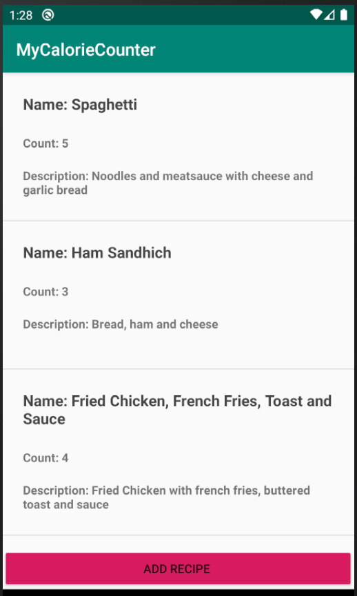

# MyCalorieCounter

## App Description
MyCalorieCounter is an Android application built with Kotlin. With MyCalorieCounter, users will be able to create food items and list its nutritional value. With these food items created, recipes can be created to get a holistiic view of the total nutritional content. With these two enitities, the user can create caloric goals and track how many calories they have consumed.

___

## Users will be able to
* Create food items
* List their nutritional value
* Create recipes
* View the total nutritional content of the recipes.
* Create caloric goals
* Track calories consumed
___

## UI
The user interface of MyCalorieCounter is easy to use and simple.

___